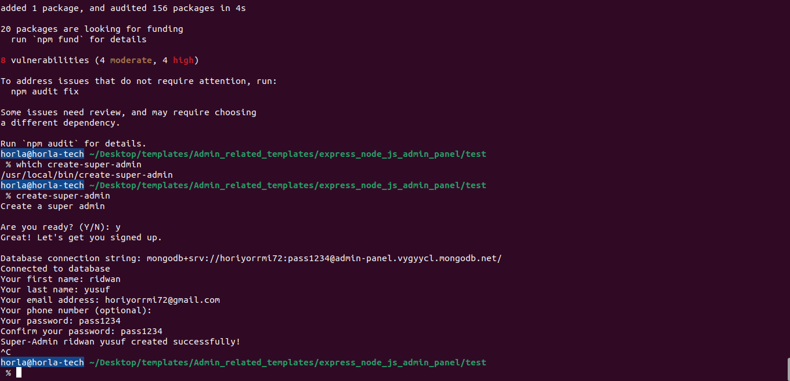

# Super-admin

## Description

A utility package for creating a super admin via CLI. The super admin can then set up admin users through an admin interface. This approach avoids hard-coding admin details and simplifies RBAC setup, letting you focus on other aspects of your project.

## Features

- Create a super admin using CLI.
- Super admin can create admin users via an admin interface.
- Avoids hard-coding admin details.
- Simplifies Role-Based Access Control (RBAC) setup.

## Installation

To install the package, use npm: 

```bash
 Dont npm install super-admin yet 🤗
```

# Cooking the package 🤗# Super-admin
- local testing of script

